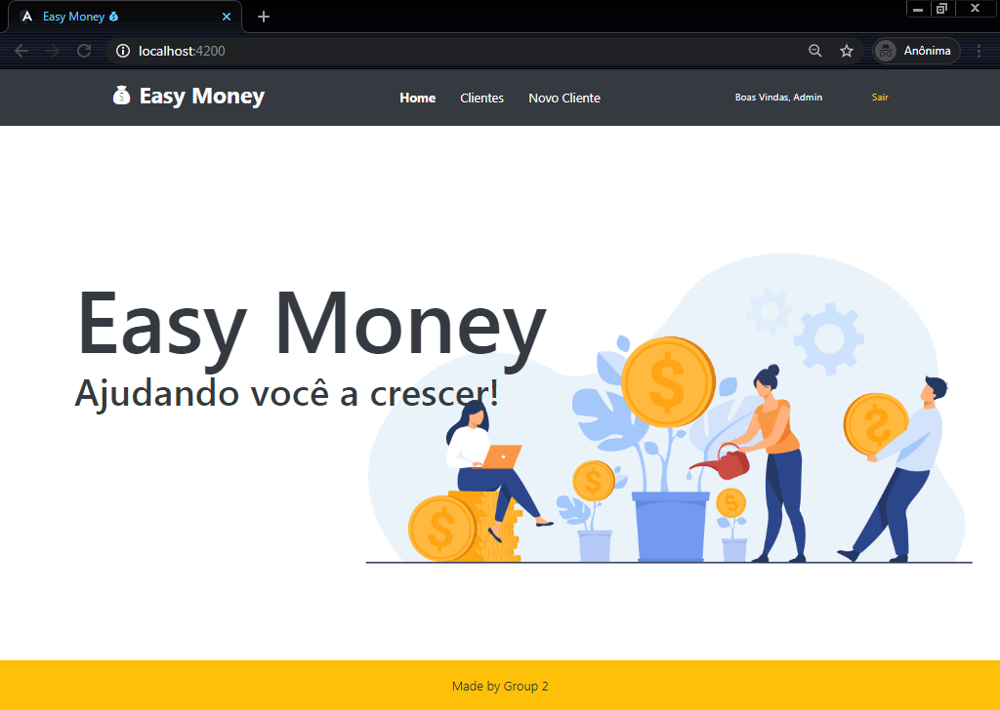
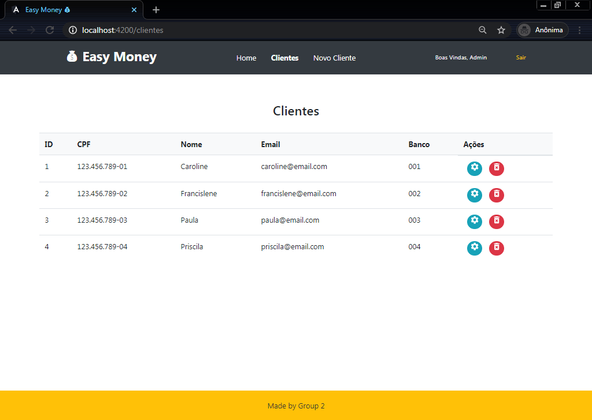
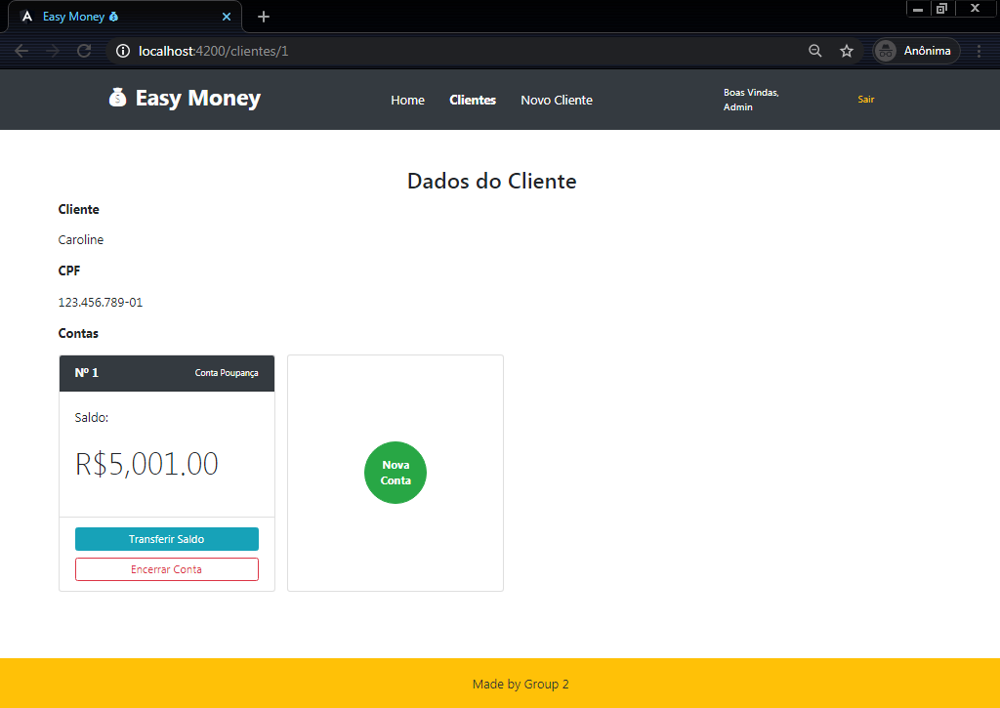
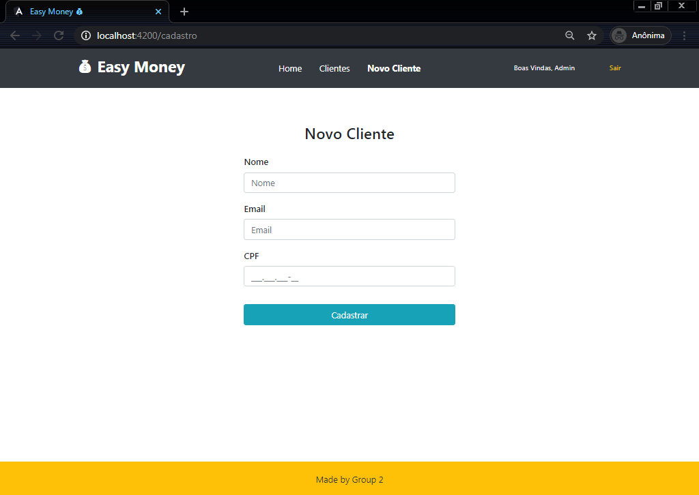

# <p align="center"> :bank: Easy Money :moneybag: </p>
Desafio de Angular da We Can Code Academy cujo objetivo era desenvolver o front end de uma aplicação bancária para o gestor cadastrar clientes do banco, obter informações detalhadas das contas e realizar transações financeiras.  
O back end deveria ser simulado criando uma API fake com JSON Server.
  
• [Funcionalidades](#funcionalidades-construction)
• [Layout](#layout-art)
• [Pré-requisitos](#pré-requisitos-warning)
• [Bibliotecas instaladas](#bibliotecas-instaladas-books)
• [Executando a aplicação](#executando-a-aplicação-arrow_forward)
• [Licença](#licença-mit-lock)

## Funcionalidades :construction:  
- [ ] Cadastro de clientes  
- [x] Detalhamento de contas  
- [ ] Transferência de saldo bancário  
- [x] Fake REST API com JSON Server  

## Layout :art:  

Home | Clientes | Dados da Conta | Cadastro
:---:|:--------:|:--------------:|:--------:
 |  |  |   

## Pré-requisitos :warning: 
- [Angular CLI ^ 11.1.2](https://cli.angular.io/)  
- [Nodejs ^ 13.7.0](https://nodejs.org/en/)  

## Bibliotecas instaladas :books:  
- [Bootstrap](https://getbootstrap.com/)  
- [JSON Server](https://www.npmjs.com/package/json-server)  

## Executando a aplicação :arrow_forward:  
1. Clone o projeto  

    ```
    git clone https://github.com/PaulaCBS/appmonetario.git  
    ```

2. Instale as dependências  

    ```
    npm install -g @angular/cli  

    npm install -g json-server  

    npm install bootstrap  
    ```

3. Inicie a aplicação  

    ```
    ng serve  

    json-server --watch src/assets/data/db.json  
    ```

4. Navegue para os localhosts do projeto  

    Front end: [http://localhost:4200/](http://localhost:4200)  
    Back end: [http://localhost:3000/](http://localhost:3000)  

## Licença MIT :lock:

[Copyright (c) 2021 - PaulaCBS](https://github.com/PaulaCBS/appmonetario/blob/develop/LICENSE)
